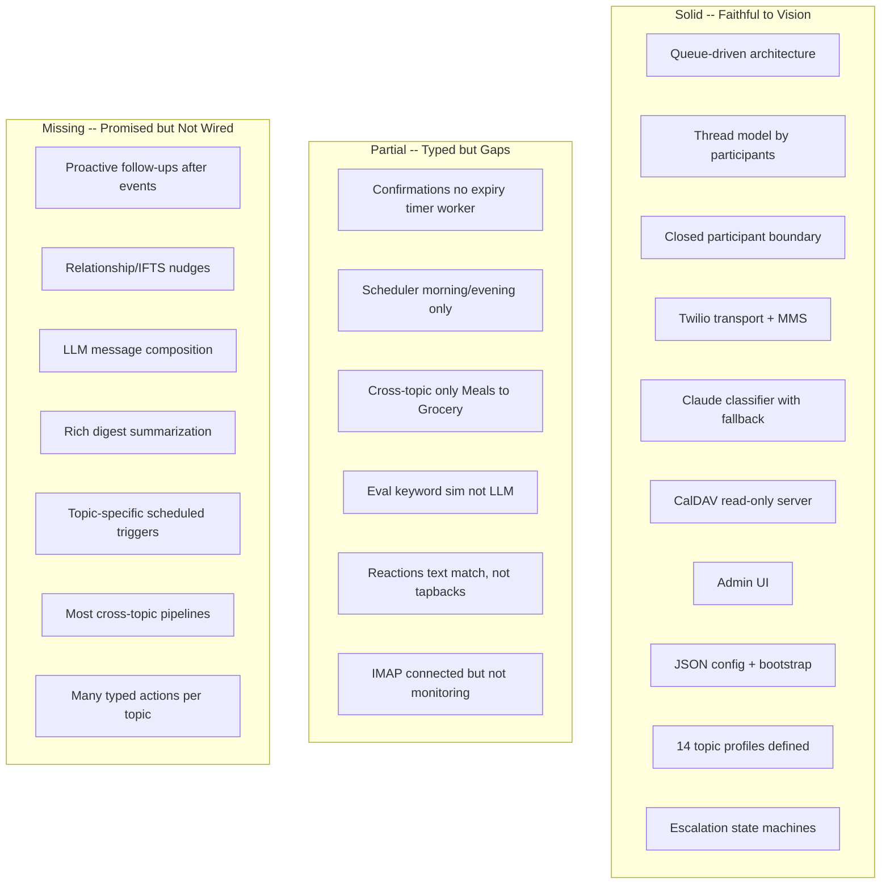

Here's the gap analysis, organized around the themes you laid out across those 20 design conversations.

---

## Vision vs Reality -- The Big Picture

The **structural skeleton** is solid and faithful to the original concept. The parts that are "done" are genuinely done well: queue-driven architecture, thread model, participant boundary, transport layer, classifier with Claude fallback, CalDAV serving, admin UI, eval framework. What's missing is almost entirely in the **"intelligence" layer** -- the proactive, contextual, relationship-aware behavior that would make a family actually enjoy using this daily.

---

### 1. "Real intelligence" -- the biggest miss

**What you described:**

> "a couple hours later, I received a message, hey, any follow-up information? Like, real intelligence like that"

**What exists:** Health profile defines `healthFollowUpTime` (+4 hours). Vendor profile defines `shouldSendVendorFollowUpReminder`. Relationship profile defines `selectNextRelationshipNudgeType`. Calendar profile has `follow_up_offset_hours`. **None of these are called by any code outside their own profile file.** The scheduler only fires morning digest and evening check-in ticks. There is no mechanism that says "this appointment ended at 2pm, fire a follow-up at 6pm."

The escalation service handles nudge _escalation_ (reminder -> follow-up -> escalate to broader thread), but that's for _accountability on assigned tasks_, not contextual post-event intelligence.

---

### 2. Message composition is templates, not Claude

**What you described:**

> topic personalities, different themes, IFTS-style therapy in the relationship channel, nuanced responses

**What exists:** Classification uses Claude. But `composeMessage` in `StaticTopicProfileService` returns static strings from `TONE_TEMPLATES` keyed by tone bucket (warm/direct/factual) and intent. The output for a Calendar request with "warm" tone is literally `"Got it, I'll take care of that."` -- identical to Relationship, Health, Pets, or any other warm-tone topic.

The grocery topic is the only one with real domain-specific composition (it formats item lists). Every other topic gets generic one-liners. The "IFTS-style" relationship facilitation, the contextual chore nudging, the empathetic health follow-ups -- none of that exists in the composition layer.

---

### 3. Cross-topic connections are almost entirely declared but not wired

**What you described:**

> data sources feeding the system, information surfaced to relevant users, meals connecting to grocery

**What exists:** 9 of 14 topics declare `cross_topic_connections` in their profile. But `buildCrossTopicContent` only returns non-null for **Meals -> Grocery** (via `extractGroceryItemsFromMealDescription`). Every other cross-topic connection (Calendar->School, Health->Calendar, School->Calendar, Travel->Calendar, Business->Calendar, Grocery->Meals, etc.) hits `return null` and produces no queue item.

---

### 4. IMAP email monitoring is a connected stub

**What you described:**

> "emails being seen in real time", "forwarded a text", "some other way to patch in data so the user doesn't need to inform the assistant"

**What exists:** `startMonitoring` connects to IMAP via ImapFlow and opens the mailbox, then returns the client handle. It does not fetch messages, idle-watch, or call `processInboxMessage`. The full parsing pipeline (Claude extraction, .ics handling, queue enqueue) exists and works in tests -- it's just never triggered by the live mail connection. `produceIngestItems` returns `[]`.

---

### 5. Most typed actions per topic are declared but not reachable

**What you described:**

> "fully automate and manage things for a family where the effort was so minimal"

**What exists:** The worker's `resolveAction` switch covers the "happy path" action for each topic (create, add, log, query). But many secondary actions are defined in topic `types.ts` files and never appear in `resolveAction` or `applyStateMutation`:

- **Finances:** `pay_bill`, `adjust_savings` -- typed, never resolved
- **Travel:** `update_trip`, `cancel_trip`, `update_checklist`, `add_itinerary_segment` -- typed, never resolved
- **Vendors:** follow-up actions -- typed, never resolved
- **Business:** pipeline stage transitions, draft flows -- typed, never resolved
- **Relationship:** `record_nudge_ignored`, `set_quiet_window` -- typed, never resolved
- **Maintenance:** `items` array exists in state but worker only pushes to `assets` -- items stay empty

---

### 6. Confirmations work but expiry is passive

**What you described:**

> "multiple choice, 1 through 5, yes and no"

**What exists:** Opening confirmations, presenting choices, matching replies by alias -- all work. But `scheduleExpiryTimer` enqueues delayed jobs on `fcc-confirmation-timers`, and **no BullMQ Worker consumes that queue** in `server.ts`. Expiry only fires when the next inbound message happens to trigger `expireOverduePending`, or on app restart via `reconcileOnStartup`. A confirmation could sit "pending" for days with no timeout notification if nobody texts.

---

### 7. Eval is deterministic keyword simulation, not model-driven

**What you described:**

> "generate infinite scenarios, play them out, figure out what went wrong, so that the model is being respected or even tune the model"

**What exists:** `inferTopicByKeywords` and `inferIntent` in the eval runner use string matching, not Claude. `composeMessage` returns hardcoded strings. Multi-turn context tracking was recently added (our previous work), but the eval proves the _keyword simulator_, not the _actual Claude classifier + composition pipeline_. A scenario that passes in eval doesn't guarantee the real system classifies or responds the same way.

---

### 8. Reactions are text-matching, not true tapbacks

**What you described:**

> "thumbs up / thumbs down" (later anonymized to positive/negative reactions)

**What exists:** The transport layer checks if the SMS `Body` text matches words like "yes", "done", "no" and emits `TransportInputKind.Reaction`. This is not iMessage tapback detection -- Twilio doesn't surface tapback events for standard SMS/MMS. The confirmation service has a `"positive"` / `"negative"` substring check path, but the transport never actually produces those strings.

---

### 9. Digest is template sections, not intelligent summarization

**What you described:**

> "meaningful cross-topic recap (wins, pending, urgent, today/tomorrow)", "good stuff" requests needing richer summarization

**What exists:** `composeDigestMessage` in the worker builds a sectioned output (Urgent, Today, Pending, Wins, Status) by reading state arrays and formatting one-liners. It does not call Claude. It doesn't weigh what matters, surface highlights, or adapt to what the person cares about. It's a state dump with headers.

---

### What you nailed

To be fair, the things that _are_ built are built well and match the vision closely:

- **"One phone number, threads by participants"** -- exactly as described
- **"Queue everything, worker pulls one at a time"** -- exactly as described
- **"JSON config, start in any state"** -- `SystemConfig` + `SystemState` + bootstrap
- **"Simple, no Rocket.Chat"** -- Node + Fastify + SQLite + Redis, no Docker/Mongo
- **"Closed boundary, no strangers"** -- transport-level enforcement
- **"Budget/rate limiting to avoid alert fatigue"** -- implemented with budget service
- **"Escalation with accountability"** -- XState machines, multi-step profiles
- **"CalDAV so calendar apps subscribe"** -- working read-only endpoint
- **"Admin UI for operators"** -- full React/shadcn dashboard

The gap is concentrated in one area: **the system processes requests competently but doesn't yet think ahead, speak naturally, or connect the dots across topics.** The plumbing is there. The intelligence layer on top of it is mostly stubs.
